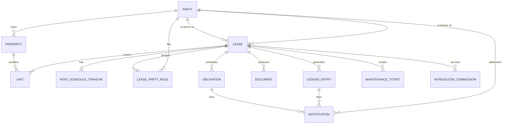

# RPMS — Rental Property Management System

**Owner:** Capital Trust Holdings Limited (and affiliated entities: Capital Trust Properties One, Capital Trust Residencies, Tech City Lanka, Capital BPO, Colombo BPO)
**Status:** Draft v0.1 — 2026-05-05
**Authors:** Mevan + Claude

---

## 0. One-line summary

A Next.js + Vercel Workflows platform that replaces a sprawling Excel-based operation managing 300+ tenancies across multiple buildings, two business lines (commercial leases, BPO/residential), and a stakeholder graph of landlords, clients, tenants, introducers, lawyers, and accountants.

## 0.1 MVP scope (2026-05-13) — show the client a focused surface

The full system described in §3–§21 is the long-term target. To avoid overwhelming Capital Trust with features they didn't ask for, the **initial product surface** the client sees is deliberately narrow. We progressively unhide the rest as they validate each piece.

**What ships in the MVP demo**

| Surface | What it does | Hidden until later |
|---|---|---|
| **Dashboard** | KPI cards (Active leases, Parties, Buildings, Overdue) + a single leases table. | Live activity feed, autonomy banners, "next 14 days" / escalations panels. |
| **Properties** | List of buildings + detail page. | Units page, parties directory, documents vault. |
| **Leases** | Lease list, lease detail (parties, schedule, units, rent schedule, recent ledger), new-lease wizard. | Documents tab, draft-lease decision queue surfaced as its own section. |
| **Rent** | Single page showing every rent ledger line, bucketed `Overdue / Due in 14 days / Upcoming / Paid`. Each row has two operator actions: **Mark paid** (after the user has manually verified the bank credit) and **Send reminder** (queues an email to tenant + landlord on file). | Bank-reconciliation inbox, commissions, automated rent-collection cycle, full reminders queue. |
| **Settings** (admin only) | Import, Templates, Workflows, Users, Access (RBAC matrix). | — |

**Three roles only**

| Role | Sees | Can do |
|---|---|---|
| `admin` | Everything in the visible surface + Settings + RBAC + reset demo. | All actions. |
| `account_manager` | Dashboard, Properties, Leases (all), Rent (all). | Create/edit properties, leases, units, parties; mark rent paid; send reminders. |
| `lawyer` | Dashboard, Properties (read), Leases **scoped to `assignedLeaseIds`**, Rent **scoped to the same leases**. | Read-only on leases + documents. Cannot mark rent paid or send reminders. |

The legacy `handler` / `accountant` / `viewer` / `introducer` roles are removed from `DEFAULT_ROLES` (so the RBAC matrix only shows three columns) and from `PRESET_USERS` (so the login page only offers admin + account manager + two scoped lawyers). Resource strings like `commissions:*`, `maintenance:*`, `compliance:*`, `tasks:*`, `automation:*` stay in the catalogue so the deferred routes still compile, but no role grants them — the sidebar groups for them are commented out, not deleted.

**Two demo overlays that make the MVP feel real**

1. `state.rentPayments: Record<ledgerEntryId, RentPaymentRecord>` — captures the manual "Mark paid" clicks. Persisted in `localStorage` so refreshing the demo retains the reconciliations. Phase 02 replaces this with a real row update.
2. `state.rentReminders: RentReminderRecord[]` — every "Send reminder" click queues an entry here and pushes a `human` activity. Phase 02 swaps this for a Resend send + audit row.

**Hidden ≠ deleted.** All deferred routes (`/payments`, `/payments/inbox`, `/commissions`, `/reminders`, `/maintenance`, `/compliance`, `/tasks`, `/activity`, `/automation`, `/reports/*`, `/units`, `/parties`, `/documents`) still exist on disk so the unhide is a sidebar edit, not a rebuild. SPEC §6 lists the eventual IA; §21 documents the legacy six-role model — both kept as the target state.

## 1. Why we are building this

The current system is one Google Drive folder, one shared Excel workbook (`rentals-sheet.xlsx`) with 5 tabs (Monthly, Quarterly, Bi-Annual, Introducer, SD), and human-driven Gmail reminders. Symptoms:

- **Scale:** ~300 active tenancies across at least 6+ buildings (Lucky Seven, Trizen, Capitol TwinPeaks, CTR Thimbirgasyaya, Capital Trust Tower One, Alfred series, etc.). The workbook breaks at this size — race conditions on edits, dropped reminders, formulas referencing dead rows (`#REF!` already visible in the SD tab).
- **No source-of-truth contract data:** The signed Lucky Seven lease (Rs. 879,134,400 over 10 years, 26.03.2026–25.03.2036) lives as a CamScanner PDF; the *exact same* lease exists as a `.docx` draft and as a row in the workbook. No system reconciles them.
- **Money flows are manual:** Stamp duty (Rs. 17,582,688 on Lucky Seven alone, 2%), legal fees (1%), security deposits, advance rent, and monthly balance rent are tracked across emails and bank drafts. No ledger.
- **Reminders are ad hoc:** Per-tenant `Send Landlord` / `Send Tenant` 0/1 flags and a `TO →` cell in row 1 imply the workbook drives a mail-merge today. Brittle.
- **Introducer commissions** (e.g., "stephen" referrer across the BPO tab) have no payout pipeline.
- **Compliance is invisible:** VAT reimbursement, lift maintenance, generator servicing, fire detection — all mandated by the lease, none scheduled.

## 2. Glossary

| Term | Meaning |
|---|---|
| **Lessor** | Property owner (e.g., Y.S. Hewage Sunil Malcom Silva for Lucky Seven). The "landlord". |
| **Lessee** | Party paying rent on the head lease. Almost always a Capital Trust group entity. |
| **Client** | B2B counterparty in sublease arrangements (e.g., Modern Mark Development, MRL, Tech City Lanka). |
| **Tenant** | The end-occupant of a unit. Sometimes the same as Client (commercial), sometimes an individual (BPO). |
| **Introducer** | Referrer of a tenant, paid commission. |
| **Accountant / Handler** | Internal Capital Trust staff who owns the relationship operationally (Tajini, Dharmendra, Stephen). |
| **Property Investment Advisor** | Internal advisor on the deal (e.g., Bhanuka). |
| **Head lease** | Capital Trust's lease *from* an external landlord. |
| **Sublease** | Capital Trust's lease *to* a tenant. The product is the spread. |
| **Stamp duty** | 2% of total lease consideration, payable to the Sri Lankan government, lessee's burden. |
| **Lock-in period** | Initial term during which neither party may terminate without penalty (5 years for Lucky Seven). |
| **Grace period** | Rent-free initial months for fit-out (3 months for Lucky Seven). |

## 3. Source-of-truth lease anchor: Lucky Seven Building

This is the canonical reference for the data model. Every clause has a corresponding field.

| Field | Value | Clause |
|---|---|---|
| Premises | Lucky Seven Building, Asst No. 314 R.A. De Mel Mawatha, Kollupitiya, Colombo. Lot R, Plan 6434. 20.75 perches. | Schedule 1 |
| Lessor | Y.S.H. Sunil Malcom Silva (NIC 56188258V), No. 83 Main Street, Panadura | Recital 1 |
| Lessee | Capital Trust Holdings Limited (PV 75497PB) | Recital 2 |
| Demised premises | Floors 1, 2, 3, 4 + Penthouse on 5th (~19,342 sq ft) | §1 |
| Term | 10 years: 9 April 2026 – 8 April 2036 | §2 |
| Grace period | 3 months (9 Apr 2026 – 8 Jul 2026) — no rent payable | §2(m) |
| Rent schedule (5 tranches, every 2 years) | 6.0M → 6.6M → 7.26M → 7.986M → 8.7846M LKR/month | §3(a)–(e) |
| Total consideration | Rs. 879,134,400 | §3 aggregate |
| Advance rent | Rs. 72,000,000 set off as Rs. 600,000/month × 120 months | §3.a |
| Balance rent due | 9th of each month (calendar discrepancy with `26th` in checklist — **flag for clarification**) | §3 + §4(a) |
| Security deposit | Rs. 18,000,000 refundable | §6(j) |
| Stamp duty | Rs. 17,582,688 (2%) — lessee | Checklist |
| Legal fees | Rs. 4,395,672 (1%) — lessee | Checklist |
| Lock-in | 5 years; 6 months rent as liquidated damages either side | §6(i)(a)(b) |
| Post-lock-in termination notice | 12 months written; 3 months rent as liquidated damages either side | §6(i)(c)(d) |
| Late payment penalty | Rs. 25,000/day after 7-day delay | §6(k) |
| Material breach (rent) | 3 consecutive months unpaid | §6(l) |
| Renewal notice | 12 months before expiry | §6(g) |
| Use restriction | BPO services to foreign clients (Customer Support, Accounting, IT, HR, Entertainment); top floor may be office or residential | §4(i) |
| Permitted sublessees | Wholly-owned subs + named: Tech City Lanka, Capital BPO, Colombo BPO | §4(i) |
| Lessor obligations | Lift, generator (with fuel cost share), parking lots, fire detection system + extinguishers | §5(k)(l)(m)(n) |
| VAT | Lessee reimburses lessor on receipt + VAT invoice within 14 days | §4(o) |
| Statues | Lessee responsible for 13 Italian cement sculptures on Penthouse balcony | §4(p) |
| Minor repairs cap | Rs. 75,000 per job per floor by lessee | §4(m) |
| Notary | Sulochana Manamperi, Panadura | Cover |
| Witnesses | 2 (signatures present) | Schedule |

> **The data model below must encode every row of this table as a typed, queryable, alertable field. If a clause produces a date, the system must be able to fire workflows on that date.**

## 4. Two product surfaces

The same platform handles two materially different operations. Both share entities but have different defaults and workflows.

### 4a. Commercial head leases (Lucky Seven pattern)
- Counterparties: external landlords ↔ Capital Trust group
- Single agreement, multi-million LKR consideration, notary-attested
- Escalations on 2-year cycles
- Heavy compliance: stamp duty bank drafts, legal fees cheques, VAT invoicing
- Few in count (tens), high-stakes per agreement
- Lawyer-driven onboarding

### 4b. BPO/residential subleases (Trizen / Capitol TwinPeaks / CTR pattern)
- Counterparties: Capital Trust ↔ BPO clients (MRL, Tech City) and individual tenants
- Standardised 1-year contracts, USD-denominated rent (1,250–1,500 USD/month typical)
- High volume (~300 active), introducer-driven onboarding
- Mail-merge reminders to landlord *and* tenant on cadence (monthly / quarterly / bi-annual)
- Existing aliases: `accommodationbpo@gmail.com`, `chamodi.niluthpala@gmail.com`, `amycapili0@gmail.com`, `ktan0857@gmail.com` are CCs on tenant comms

## 5. Domain model

### 5.1 Entity-relationship overview



### 5.2 Core entities

**`property`** — A building. `id, name, address, city, district, total_area_sqft, lot_no, plan_no, perches, asst_no, registry_volume, registry_folio`.

**`unit`** — A leasable subdivision (floor, apartment, storage). `id, property_id, label, floor, area_sqft, type (office|apartment|storage|penthouse), bedrooms, status`.

**`party`** — Any natural or legal person. `id, kind (individual|company), display_name, legal_name, nic_or_passport, company_reg_no, addresses[], emails[], phones[], banking[]`.

**`lease`** — A contract. `id, property_id, lessor_party_id, lessee_party_id, kind (head|sub), purpose (commercial|residential|bpo), start_date, end_date, lock_in_end_date, grace_period_end_date, currency, status (draft|signed|active|grace|terminated|expired|renewed), notary_party_id, signed_pdf_doc_id, draft_doc_id, parent_lease_id (for subs)`.

**`lease_unit`** — many-to-many between `lease` and `unit` (Lucky Seven covers 5 floors).

**`lease_party_role`** — additional roles on a lease beyond lessor/lessee. `lease_id, party_id, role (introducer|advisor|lessor_lawyer|lessee_lawyer|accountant_handler|witness|sublessee_named)`.

**`rent_schedule_tranche`** — escalation step. `lease_id, sequence, start_date, end_date, monthly_rent, currency, advance_setoff_amount, due_day_of_month, payment_mode_default`.

**`obligation`** — every clause-derived recurring or one-time duty. `lease_id, kind (rent_due|deposit_due|stamp_duty|legal_fees|insurance|lift_service|generator_service|fire_inspection|vat_reimbursement|colour_wash|renewal_notice|termination_notice|grace_end|lockin_end|escalation|lease_expiry|statue_inspection), due_date, amount, currency, owner_party_id, status (pending|done|overdue|waived), source_clause`.

**`ledger_entry`** — the truth about money. `id, lease_id, obligation_id?, kind (rent|deposit|stamp_duty|legal_fees|vat|late_fee|refund|commission|adjustment), amount, currency, direction (in|out), counterparty_party_id, due_date, paid_date, payment_method (lkr_cash|lkr_transfer|usd_transfer|bank_draft|cheque), reference, notes, attachment_doc_id`.

**`document`** — every file. `id, kind (lease_draft|lease_signed|invoice|receipt|kyc_id|company_reg|stamp_duty_receipt|vat_invoice|notice|payment_proof), party_id?, lease_id?, blob_url, sha256, filename, mime, version, created_at, signed_status, signed_at, esig_provider_envelope_id`.

**`notification`** — outbound communications. `id, channel (email|whatsapp|sms), template_id, recipient_party_id, lease_id?, obligation_id?, ledger_entry_id?, payload_json, status (queued|sent|delivered|opened|failed), sent_at, opened_at, error`.

**`notification_template`** — versioned templates. `id, name, channel, locale (en|si|ta), subject_tpl, body_tpl (mustache or react-email), required_vars`.

**`workflow_run`** — Vercel Workflow execution log. `id, workflow_kind, lease_id?, started_at, finished_at, status, input_json, output_json, error`.

**`maintenance_ticket`** — `id, lease_id, unit_id, opened_by_party_id, kind (running|repair|major), description, cost_cap (75_000_or_other), status (open|in_progress|done|disputed), invoices[], opened_at, closed_at`.

**`introducer_commission`** — `id, lease_id, introducer_party_id, basis (one_off|monthly), rate_pct_or_amount, schedule, accrued, paid, last_paid_at`.

**`audit_log`** — every mutation, who, when, before/after JSON.

## 6. Information architecture

> **MVP carve-out (2026-05-13):** the sidebar surfaces only `/`, `/properties`, `/leases`, `/rent`, and `/admin/*`. The rest of this section is the target state we expand into as the client validates each piece. See §0.1.

Routes (App Router):

```
/                                  # Dashboard (KPIs, today's actions)
/properties
/properties/[id]                   # Property detail + units + active leases
/units                             # Unit-centric view (occupancy heatmap)
/parties                           # Landlords, clients, tenants directory
/parties/[id]
/leases
/leases/new                        # Onboarding wizard
/leases/[id]                       # Lease workspace (parties, schedule, ledger, docs, obligations)
/leases/[id]/draft                 # Draft generator + e-sign
/leases/[id]/timeline              # Obligations + workflow runs
/rent                              # MVP — Operator board: every rent line w/ Mark paid + Send reminder
/payments                          # Ledger view, filters
/payments/inbox                    # Unmatched bank refs needing reconciliation
/reminders                         # Notification queue + history
/documents                         # Document vault, full-text search
/maintenance                       # Tickets
/commissions                       # Introducer payouts
/compliance                        # VAT, stamp duty, lift, fire calendar
/reports/rent-roll
/reports/arrears
/reports/escalations
/reports/cashflow
/admin/users
/admin/templates
/admin/workflows                   # Workflow registry + manual trigger
/admin/import                      # XLSX importer
/api/...                           # tRPC or REST endpoints
/api/workflows/[name]              # Vercel Workflow handlers
/api/webhooks/esign                # DocuSign / equivalent
/api/webhooks/email                # Inbound email parsing (bank confirmations)
```

## 7. Workflows

Every workflow runs on Vercel Workflows now and is built so the handler is a pure function over typed input — making the AgentFabriq port a re-host, not a rewrite. Each workflow declares `kind`, `triggers`, `idempotency_key`, `compensations`.

### 7.1 Tenant onboarding (sublease)

```
trigger: POST /api/workflows/onboard-tenant
input: { intent: { property_id, unit_ids, client_party_id?, tenant_party_id?, introducer_party_id?, rent, currency, start_date, duration_months, deposit, payment_cadence } }

steps:
  1. KYC.collect           -> uploads ID/passport, company reg → store as DOCUMENT(kyc_id|company_reg)
  2. Party.upsert          -> create/find PARTY rows
  3. Lease.draftGenerate   -> render template against intent + KYC → DOCUMENT(lease_draft)
  4. Lawyer.review         -> task assigned to CTP Lawyer; gates next step
  5. Esign.send            -> push to provider; store envelope id
  6. Esign.awaitWebhook    -> wait state; on signed, attach DOCUMENT(lease_signed)
  7. Money.collectInitial  -> emit OBLIGATIONs for deposit, stamp duty, legal fees, advance rent
  8. Schedule.materialize  -> expand RENT_SCHEDULE_TRANCHE into per-month OBLIGATIONs
  9. Compliance.kickoff    -> emit lift/generator/fire/VAT/colour-wash recurrences (if head lease)
 10. Welcome.notify        -> send tenant welcome email + handover checklist
 11. Commission.accrue     -> if introducer present, create INTRODUCER_COMMISSION
```

### 7.2 Rent collection cycle

Per-lease cadence (monthly / quarterly / bi-annual) drives a recurring workflow.

```
trigger: cron — daily; selects OBLIGATIONs with kind=rent_due in [today+15, today-30]
input: { obligation_id }

steps:
  1. Reminder.preBill      -> T-7 days before due_date: notify tenant + landlord (if head lease)
  2. Reminder.dueDay       -> on due_date
  3. Bank.match            -> reconcile against inbound bank notifications (email parser)
                              if matched -> Ledger.markPaid -> exit
  4. Reminder.day1Late     -> due_date+1: tenant + handler
  5. Penalty.accrue        -> at due_date+7, start LATE_FEE accrual at Rs. 25,000/day (commercial)
  6. Reminder.day14Late    -> due_date+14: tenant + handler + accountant escalation
  7. Reminder.day30Late    -> due_date+30: legal team CC; create breach watch ticket
  8. Breach.detect         -> if 3 consecutive months unpaid (commercial) -> material breach workflow
```

### 7.3 Lease lifecycle calendar

Standing workflows fire on derived dates:

| Date | Workflow |
|---|---|
| `lease.start_date - 60d` | Pre-mobilisation: KYC complete, deposit cleared, stamp duty paid, lawyer sign-off |
| `lease.start_date` | Activate lease, materialize obligations |
| `lease.grace_period_end_date - 14d` | Notify lessee that rent begins soon |
| Each escalation boundary | Send revised invoice template; update RENT_SCHEDULE_TRANCHE active row |
| `lease.lock_in_end_date - 30d` | Notify both parties of post-lock-in regime |
| `lease.end_date - 365d` | Open renewal discussion (12-month notice clause) |
| `lease.end_date - 90d` | Move-out logistics: final inspection, deposit reconciliation plan |
| `lease.end_date` | Compute deposit refund net of damages, late rent, utilities; produce statement |

### 7.4 Document generation & e-sign

- Templates in `/templates/leases/{commercial|residential}.docx` with `{{mustache}}` fields.
- `Lease.draftGenerate` step: docxtemplater → DOCX → headless LibreOffice or Cloudmersive → PDF → Vercel Blob.
- E-sign provider: **DropboxSign** (formerly HelloSign — cheaper, better Sri Lanka card support) or **DocuSign**. Webhook on `signature_request_signed` → `Esign.awaitWebhook` resumes.
- Notarisation: out-of-band; system stores notary, code no., judicial division, registry volume/folio after the fact.
- Versioning: every regenerate bumps `document.version`; old versions retained (lease drafts often go through 6+ revisions).

### 7.5 Compliance scheduler

Recurring obligations the lease creates:

- **Lift servicing** — monthly, lessor-funded, lessor's vendor; system tracks last service date.
- **Generator servicing** — periodic, lessor-funded, fuel cost shared on continuous outage.
- **Fire detection inspection** — annual minimum.
- **VAT invoice request** — every time rent is paid; invoice must arrive within 14 days; if not, raise alert.
- **Stamp duty filing** — one-time per lease; bank draft to CMC; receipt attached.
- **Colour wash** — interior every 2 years, by lessee, after lessor's exterior wash.
- **Statue inspection** (Lucky Seven) — quarterly; flag any damage to the 13 Italian sculptures.

### 7.6 Maintenance

- Tenant raises ticket via portal → routed to handler → handler approves → vendor assigned → invoice attached.
- Auto-cap check: if estimated cost ≤ Rs. 75,000/job/floor and lessee-side, no approval needed.

### 7.7 Introducer commissions

- Commission rule (per-lease) created at onboarding.
- Accrual computed monthly when rent ledger is matched.
- Payout workflow: monthly batch → handler review → bank transfer → mark paid.

### 7.8 Bank reconciliation (inbound email parser)

- Capital Trust receives bank credit advices by email.
- Webhook to `/api/webhooks/email` (via Resend inbound or SendGrid Parse) → LLM extraction (sender bank, ref, amount, date, narrative) → match candidate ledger entries → confidence-scored auto-match or human review queue at `/payments/inbox`.

### 7.9 Workflow inventory (cron + event)

| Workflow | Trigger | Idempotency key |
|---|---|---|
| `onboard-tenant` | Manual / API | `lease_id` |
| `rent-collection-cycle` | Cron daily 06:00 LKT | `obligation_id` |
| `lease-lifecycle-tick` | Cron daily 07:00 LKT | `lease_id+date` |
| `compliance-scheduler` | Cron weekly Mon 08:00 | `obligation_id` |
| `bank-reconcile` | Inbound email | `email_id` |
| `commission-accrual` | Cron monthly 1st | `commission_id+month` |
| `commission-payout` | Manual batch | `batch_id` |
| `esign-resume` | Webhook | `envelope_id` |
| `breach-detect` | After rent-collection | `lease_id` |
| `renewal-open` | Lifecycle event | `lease_id` |
| `move-out` | Lifecycle event | `lease_id` |

## 8. Technical stack

| Concern | Choice | Reason |
|---|---|---|
| Framework | Next.js 15 App Router, TS, Turbopack | Vercel-native, RSC for heavy report pages |
| UI | Tailwind + shadcn/ui + lucide-react | Speed, consistency |
| Forms | react-hook-form + zod | Validation parity client/server |
| API | tRPC over App Router (`/api/trpc/[trpc]`) | End-to-end types; switch to REST for external callers |
| Auth | Clerk | Sri Lanka phone OTP support, org/team model fits Capital Trust group |
| DB | Neon Postgres (serverless) | Branching for staging, Vercel integration |
| ORM | Drizzle | Lightweight, SQL-first, edge-friendly |
| File storage | Vercel Blob | Direct SDK, simple |
| Email out | Resend + react-email | Templates as components |
| Email in | Resend Inbound or SendGrid Parse | Bank advice parsing |
| WhatsApp/SMS | Twilio (Sri Lanka long codes) | Reach individual tenants on WhatsApp |
| E-sign | DropboxSign (default) or DocuSign | Webhook-driven, cheaper for SL volume |
| Document gen | docxtemplater + headless LibreOffice in a Vercel Function | DOCX → PDF, deterministic |
| OCR (lease scans) | Anthropic claude-opus-4-7 with vision + DOCUMENT_AI fallback | Lessor-supplied scans, ID extraction |
| Workflows | Vercel Workflows | User mandate; durable, observable |
| Background long jobs | Inngest only if Vercel Workflows can't cover (e.g., 30-min OCR) | TBD |
| Observability | Vercel Observability + Sentry + Axiom | Logs, traces, errors |
| Testing | Vitest (unit), Playwright (e2e) | Standard |
| CI | GitHub Actions → Vercel preview | Preview per PR |
| Migration | drizzle-kit | Schema PRs |
| Secrets | Vercel env + Doppler (optional) | Per-environment |

## 9. Vercel Workflows + AgentFabriq

- **Now (V1):** All orchestration lives in Vercel Workflows. Handlers are colocated under `/src/workflows/{kind}/index.ts`. Each step is an idempotent function with explicit retry/compensation. State persisted in `workflow_run`.
- **Next (V2):** AgentFabriq plugs in as an alternate executor for *agentic* steps (e.g., bank-reconcile email parsing, KYC document review, tenant Q&A). Deterministic steps (rent reminders, invoice rendering, ledger writes) remain on Vercel Workflows.
- **Boundary contract:** every handler exposes `(input: ZodType) => Promise<Output>`. AgentFabriq becomes a transport, not a logic owner. The same step file runs unchanged.

## 10. Data migration from existing Excel

`docs/extract.py` already converts the workbook to CSVs. The first migration job:

1. Parse `rentals-sheet__{Monthly,Quarterly,Bi-Annual,Introducer,SD}.csv`.
2. **Decode Excel serial dates** — the CSVs leak raw serials (e.g., `45717.0` = 2025-03-09). Do this in a single `excel_serial_to_date()` helper.
3. Detect sheet → cadence mapping (Monthly tab = monthly rent + 24 columns of date+paid pairs covering 2 years; Quarterly = 8 cols; Bi-Annual = 4 cols).
4. For each non-empty row:
   - Upsert `property` (Apartment), `unit` (Unit), `party` for Landlord/Client/Tenant/Introducer/Accountant.
   - Create `lease` with start, end, currency (USD if `Rent (USD)` populated, else LKR).
   - Materialize `rent_schedule_tranche` and per-payment `obligation` rows from the date columns.
   - For each `Payment N` cell with flag `1`, write a back-dated `ledger_entry` (paid). Flag `0` rows past today become arrears; future rows stay scheduled.
   - Map `Mode of Payment` → enum.
   - Capture `Send Landlord` / `Send Tenant` flags as `lease.notification_prefs`.
   - Snapshot raw row JSON into `lease.import_meta` for audit.
5. Reconcile against the signed Lucky Seven PDF as the head lease for that property — link sublease rows to it via `parent_lease_id`.
6. Output a `import_report.csv` listing: rows imported, rows skipped (and why), parties auto-merged, parties needing manual merge.

**Migration is one-shot then read-only on the source.** The Excel file is frozen on cutover.

## 11. Phased rollout

| Phase | Scope | Exit criteria |
|---|---|---|
| **P0 — Foundation (week 1–2)** | Next.js scaffold, Clerk auth, Neon + Drizzle, base schema, deploy to Vercel preview, /admin/import shell | Empty app deployed, schema migrated, login works |
| **P1 — Read-only mirror (week 3–4)** | XLSX importer, Tenants/Leases/Payments list views, Lucky Seven head lease seeded by hand | A staff member can find any of the 300 tenancies in <10s; lease detail page matches the workbook row |
| **P2 — Reminder engine (week 5–6)** | Notification templates, rent-collection-cycle workflow, dry-run mode, then live for one cadence (monthly) | Reminders sent for one full cycle without human touching Excel |
| **P3 — Onboarding & docs (week 7–9)** | Lease wizard, document generation, DropboxSign integration, KYC vault | One new tenancy onboarded entirely in-system |
| **P4 — Money in (week 10–11)** | Inbound bank email parser, payments inbox, ledger reconciliation | 80%+ of payments auto-matched |
| **P5 — Compliance + commissions (week 12–13)** | Compliance calendar, introducer commission engine | Stamp duty, VAT, lift, fire, generator all on calendar; one commission payout run |
| **P6 — Maintenance + reports (week 14)** | Tickets, rent-roll, arrears, cashflow reports | Reports exported to PDF for board |
| **P7 — AgentFabriq port** | Migrate agentic steps; keep deterministic on Vercel Workflows | Bank-reconcile + KYC review running on AgentFabriq |

## 12. Multi-entity / multi-tenancy

Capital Trust is a *group* (Holdings, Properties One, Residencies, Tech City, Capital BPO, Colombo BPO). Each lease lives under one entity. The system models this as `org` at the top:

- `org` — Capital Trust group.
- `legal_entity` — child of org; each is a `party` of kind=company. Leases reference `lessee_party_id` directly.
- Auth: Clerk org + role (`admin | handler | accountant | lawyer | viewer | introducer | tenant_portal`).
- Tenant-facing portal (later) is a separate Clerk app or scoped sub-domain.

## 13. Security & compliance

- Sri Lanka **Personal Data Protection Act 2022** — encrypt PII at rest (NIC, passport, banking).
- Document vault: server-side AES-GCM with KMS, signed-URL downloads.
- Audit log on every mutation.
- E-sign: legally binding under SL Electronic Transactions Act for non-statutory documents; **physical notarisation still required** for the head lease itself (cannot fully digitise the Lucky Seven indenture).
- Backups: Neon PITR + nightly Blob snapshot to S3 cold.
- Data retention: lease docs kept 12 years past expiry (statute of limitations + tax).

## 14. Open questions / decisions for Mevan

1. **Rent due day discrepancy.** Lease body says "9th day of each month" (§3 + §4(a)); the checklist in the workbook says "by 26th". Which is operative?
2. **Currency for BPO subleases.** Sheet shows `Rent (USD)` for Trizen/Capitol — are tenants billed in USD and receipts in USD/LKR convert? Need FX policy.
3. **Introducer commission terms.** No values are filled in any tab. Standard rate? Per-lease negotiated?
4. **`disna@capitaltrusr.lk` typo** — confirm correct domain (`capitaltrust.lk` likely). Affects notification routing.
5. **Bank list** — which Sri Lankan banks send credit advices we'll parse? (Sampath, Commercial, BOC, NDB?)
6. **WhatsApp Business** — is Capital Trust's number registered? Required for Twilio.
7. **Existing Gmail mailboxes** — `accommodationbpo@gmail.com` etc. — migrate to a workspace domain or keep?
8. **E-sign vendor budget** — DropboxSign Standard ~$25/user/month vs DocuSign Business Pro ~$45.
9. **Lease scope on V1** — do we cover *only* head leases owned/managed by the group, or also include leases where the group acts as broker only?
10. **Notary integration** — manual upload of signed scan, or an integration with notary office workflow (probably manual).
11. **Statue inspection** — is this real ongoing concern or a one-time clause? Affects whether we schedule recurring inspections.
12. **Tenants who sublet further** — clause permits Tech City Lanka, Capital BPO, Colombo BPO to be subtenants. Do those each need their own lease records?

## 15. Out of scope (V1)

- Mobile app (web responsive only).
- Predictive arrears modeling.
- Tenant-facing maintenance booking (handler raises on their behalf).
- Marketing / lead capture for new tenants.
- Property listings / availability search.
- Integration with municipal tax portals.
- Multi-currency hedging.

## 16. Repository layout (target)

```
/
├── src/
│   ├── app/                     # Next.js App Router pages
│   ├── components/
│   ├── server/
│   │   ├── db/                  # Drizzle schema + migrations
│   │   ├── trpc/
│   │   └── lib/
│   ├── workflows/
│   │   ├── onboard-tenant/
│   │   ├── rent-collection-cycle/
│   │   └── ...
│   ├── templates/
│   │   ├── leases/
│   │   └── emails/
│   └── lib/
├── docs/
│   ├── SPEC.md                  # this file
│   ├── extract.py               # xlsx/docx → text
│   ├── extracted/
│   ├── CamScanner-04-09-2026 11.47.pdf
│   ├── latest-draft-lease.VI  6.04.2026-S.docx
│   ├── rentals-sheet.xlsx
│   └── check-list-lucky-seven.xlsx
├── public/
├── tests/
└── package.json
```

## 17. Glossary of files in `docs/`

| File | Role |
|---|---|
| `CamScanner-04-09-2026 11.47.pdf` | **Signed** Lucky Seven head lease (15 pages content, 19 pages incl. blanks) — canonical legal instrument |
| `latest-draft-lease.VI  6.04.2026-S.docx` | Editable draft of the same lease — basis for future template |
| `check-list-lucky-seven.xlsx` | Onboarding intake checklist used by lawyer + handler — basis for onboarding wizard form fields |
| `rentals-sheet.xlsx` | Operational ledger — ~300 tenancies — primary migration source |
| `extracted/*.{txt,csv}` | Auto-derived plaintext mirrors so the agent and importer can read these without binary parsers |
| `extract.py` | Stdlib-only converter (zipfile + xml.etree); re-run when sources change |

## 18. Autonomy ladder & human-in-the-loop (HITL)

This is the heart of the product narrative: **every workflow runs autonomously by default, but the system asks for a human at exactly the points where the team's judgment matters — and learns from each answer until it doesn't need to ask anymore.**

### 18.1 Four autonomy levels

Each workflow handler (SPEC §7.9) carries an `AutonomyLevel`:

| Level | Behaviour | Visible to operator |
|---|---|---|
| `manual` | Every step requires a human to start and confirm. | Sidebar shows "manual"; no auto-firing. |
| `human-gated` | The system drives, pauses at named gates, asks for `Approve / Reject / Edit`. Resumes after the answer. | Approval card surfaces in `/tasks`. |
| `auto-with-review` | The system completes the run on its own; a human reviews the result after the fact. Reviews can downgrade. | Decisions log shows `by: auto`; review widget on the workflow's detail page. |
| `auto` | Fully autonomous. Only logs activity. Exception path still routes to a human. | Subtle indicator only; visible in audit. |

### 18.2 Promotion thresholds

Promotion is **confidence-driven**. Confidence is a per-workflow integer 0–100, persisted on `autonomy_entry`:

| Current level | Promotes to | At |
|---|---|---|
| `manual` | `human-gated` | 25% |
| `human-gated` | `auto-with-review` | 60% |
| `auto-with-review` | `auto` | 90% |

Confidence updates after every `ApprovalDecision`:

- Approving the system's recommended option: **+4** confidence.
- A neutral / "modify" option: **+2** confidence.
- A reject / destructive option: **−8** confidence.
- Successful auto-execution (no human contact needed): **+1** confidence drift.
- Unhandled exception or post-review reversal: **−15** confidence.

The thresholds + signs are intentionally simple so the operator narrative stays legible. (Phase 04+ can swap in an ML scorer keyed off lease attributes; the contract stays.)

### 18.3 Approval shape

```
ApprovalRequest {
  id, ts,
  workflow,                 // which step paused
  title,                    // one-line for the inbox
  question,                 // full sentence in the card
  context: string[],        // bullets — what the human needs to know
  leaseId?, amount?,
  options: [{ id, label, tone: "primary" | "secondary" | "destructive" }],
  decision?: { ts, optionId, by: "human" | "auto", note? }
}
```

The set of `options` is the product of the workflow design — e.g. `rent-collection-cycle` at the 14-day-late gate offers `[Send notice / Skip / Escalate to legal]`. **The labels are the design specification**: changing what the human sees changes what the system can be trained to do later.

### 18.4 The training matrix surface

`/automation` renders the matrix:

- One card per workflow.
- `AutonomyMeter` shows confidence with a tick at the next threshold.
- Counters: human approvals · human rejections · autonomous executions.
- A "Promote ↑" button enables once confidence crosses the threshold (manual override; the system also auto-promotes).
- Demoting back to `manual` is a single click — the demo button is hidden in admin until it's needed.

### 18.5 What gets gated, what doesn't

| Trivial (always auto, even at `manual`) | Human-gated by default |
|---|---|
| Sending pre-bill T-7 email reminders | Sending overdue / legal escalation notices |
| Auto-matching bank advice with confidence ≥ 95% | Bank advice with confidence < 95% (or amount mismatch) |
| Materializing per-month rent obligations from a signed lease | Generating a new lease draft (KYC review gate) |
| Recording an auto-paid ledger entry | Penalty waiver / refund / credit memo |
| Acknowledging a lift-service receipt | Approving a structural-repair vendor invoice |
| Posting a renewal-window-opens activity | Opening a renewal at adjusted terms |

This split is the seed for the matrix. The **gates** are the spots where Phase 02 wires the `IOnboardingWorkflow` etc. to call `requestApproval` instead of continuing.

## 19. Activity log & audit

Every meaningful event flows through one shape and lands in one feed:

```
Activity {
  id, ts,
  workflow,                       // which workflow generated it (or "system" / "human")
  severity: "info" | "success" | "warning" | "error",
  title, body?,
  leaseId?, partyId?, amount?,
  acked: boolean                  // marked as read in the bell
}
```

Three surfaces consume it:

1. **NotificationBell** in the header — last 10, with unread badge.
2. **`/activity` page** — full timeline, filterable by workflow + free-text. Acts as the audit log.
3. **Dashboard live panel** — top 6 with a pulsing green dot for events under 30 seconds old.

Decisions (`ApprovalDecision`) emit two activities each: one for the choice itself, one for any autonomy promotion that happened as a result. This is what produces the visible "graduation" moments during the demo.

## 20. Demo orchestration (Phase 01 only)

The Phase 01 prototype demonstrates the whole loop without any real backend. It does this through a small client-side overlay that **does not exist in Phase 02+**:

| Concern | Phase 01 (demo) | Phase 02+ (production) |
|---|---|---|
| Activities feed | Zustand store, persisted in `localStorage` | Postgres `activity_log` table, server-streamed |
| Approvals queue | Same Zustand store | Postgres `approval_request` + Vercel Workflow `pause-and-wait` |
| Autonomy matrix | Seed values + heuristic increments | Real workflow telemetry; promotion gated by automated test runs |
| Heartbeat | `SimProvider` ticks every 14s, generates events from `src/lib/demo/sim.ts` | Real cron + webhook triggers |
| First-run tour | Auto-launches once via `FirstRunTour` + Onborda, marked complete in store | Same Onborda integration but the simulated state is replaced by real |
| Reset demo | Wipes the Zustand store from `/admin/workflows` | N/A |

### 20.1 Files

```
src/lib/demo/
  types.ts        Activity, ApprovalRequest, AutonomyEntry, AutonomyLevel
  seed.ts         Initial state — 7 activities, 3 approvals, autonomy matrix
  store.ts        Zustand + localStorage persist, actions, selectors
  sim.ts          tickOnce() — picks an event template each beat
src/components/app/
  sim-provider.tsx           Mounts the heartbeat
  notification-bell.tsx      Dropdown with unread badge
  approvals-pill.tsx         Header pill, pulses while > 0
  activity-feed.tsx          Animated list (framer-motion)
  approval-card.tsx          Per-request card with Approve / Reject buttons
  reset-demo-button.tsx      Wipes store
src/lib/tour/
  steps.tsx       15-step Onborda tour
src/components/app/
  onborda-provider.tsx       Wraps app with Onborda + FirstRunTour
  tour-card.tsx              Branded popover for tour steps
  first-run-tour.tsx         Auto-launches once
  tour-launcher.tsx          Sparkle button in the header to retake the tour
```

### 20.2 Onborda data attributes (for tour stability)

Whenever a piece of UI is referenced by the tour, it carries a `data-onborda="..."` attribute. Adding new tour steps is a matter of adding a stable selector to a target element. Current attributes:

| Selector | Lives in |
|---|---|
| `dashboard-title` | Home page H1 |
| `dashboard-kpis` | KPI strip |
| `live-activity` | Live activity card on dashboard |
| `dashboard-approvals` | Pending approvals card on dashboard |
| `dashboard-autonomy` | Training matrix card on dashboard |
| `header-chrome` | Right-side header cluster |
| `notification-bell` | Bell button |
| `approvals-pill` | Amber pending pill |
| `tour-launcher` | Sparkle button |
| `sidebar` | The sidebar element |
| `sidebar-money` / `sidebar-operations` | Group headings in sidebar |
| `leases-table` | The leases data table |
| `lease-detail-header` | Lease detail page header block |
| `page-title` | Generic per-page anchor on `/tasks`, `/activity`, `/automation`, `/compliance` |

Writing new steps in `src/lib/tour/steps.tsx` is the standard way to grow the tour.

## 21. RBAC, identity, and user simulation

> **MVP carve-out (2026-05-13):** only three of the six roles below are active in the current build — `admin`, `account_manager`, and `lawyer`. The matrix at `/admin/access` only lists those three. The legacy roles in this section describe the target state, not what the client sees today. See §0.1.

The operator surface is a multi-role product. A handler shouldn't see admin tools, an introducer shouldn't see other introducers' commissions, an external auditor needs read-only across the portfolio. RBAC is built into the prototype from day one so every demo viewer can see *who can do what*.

### 21.1 Roles

| Role | Job | Reads | Writes | MVP? |
|---|---|---|---|---|
| `admin` | Capital Trust ops/IT lead | All | All — including RBAC + reset demo | ✅ |
| `account_manager` | Day-to-day operator (Disna) | Dashboard, Properties, Leases (all), Rent (all). | Properties, units, parties, leases, rent (mark paid), reminders (send) | ✅ MVP |
| `lawyer` | Drafts + reviews (Ruvini, Sulochana) — **scoped to `assignedLeaseIds`** | Leases + documents *for assigned tenants only*, properties:read | Read-only in MVP. Future: lease drafts, decisions. | ✅ MVP (scoped) |
| `handler` | Day-to-day operator (Tajini, Dharmendra) — *target state* | Estate, leases, payments, maintenance, compliance, reports, tasks, activity, automation | Properties, units, parties, leases, deposits, reminders, maintenance, compliance | ❌ post-MVP |
| `viewer` | Read-only (Bhanuka, external auditor) — *target state* | Most read endpoints | Nothing | ❌ post-MVP |
| `introducer` | Outside party (Stephen) — *target state* | Their leases + their commission accruals | Nothing | ❌ post-MVP |

The full matrix renders at `/admin/access` — every Resource × Role pair. In the MVP this is three columns; the legacy roles are reintroduced as we re-open the deferred surfaces.

### 21.1a Lawyer scoping

Lawyers in the MVP don't see the whole portfolio. Each lawyer has an `assignedLeaseIds: string[]` on their `AppUser` record; their list pages, lease detail pages, and rent board are filtered to those ids client-side via `src/lib/demo/scope.ts → scopeByLease`. Direct URL hits to an out-of-scope lease render the `<LeaseScopeGate>` "Out of your scope" view. Phase 02 moves this filter into Postgres RLS so out-of-scope rows never leave the server.

### 21.2 The Resource model

`Resource` strings are vertical-sliced (e.g. `payments:read`, `payments:write`, `payments:reconcile`). Adding a new resource:

1. Add the string to `Resource` in `src/lib/demo/identity.ts`.
2. Add it to `ALL_RESOURCES` + each role's permission set.
3. Annotate the relevant `NavMainItem` / `NavSubItem` with `requires: ["..."]`.
4. (Optional) wrap the page in `<RoleGate required={["..."]}>`.

Resource catalogue:

```
properties:read|write
units:read|write
parties:read|write
leases:read|write|create
documents:read|write
payments:read|write|reconcile
commissions:read|payout
reminders:read|send
maintenance:read|write
compliance:read|write
tasks:read|decide
automation:read|promote
reports:read
admin:import|templates|workflows|users|rbac|reset-demo
```

### 21.3 Three layers of enforcement

The demo enforces RBAC at three layers — Phase 02 keeps all three:

1. **Sidebar visibility.** `getSidebarItems(user)` filters `NavGroup[]` by per-item `requires`. Empty groups disappear.
2. **Page-level guard.** Sensitive routes wrap their tree in `<RoleGate required={[...]}>`. Unauthorized users get an "Access denied" view.
3. **Action-level guard.** Buttons inside pages call `can(user, "...")` to disable.

Phase 02 adds the **fourth layer** — Postgres RLS — so a compromised client can't read other entities' rows.

### 21.4 Identity & user simulation

Phase 01 ships a `currentUserId` slice in the demo store and a `/login` page that lists the active preset users:

```
Mevan         admin            (CTH, CTP-1, CTR, TCL, CBPO, ColBPO)
Disna         account_manager  (CTH, CTP-1, CTR)
Ruvini        lawyer           (CTH) — scoped to Lucky Seven + 2 Trizen subleases
Sulochana     lawyer           (CTR) — scoped to 2 CTR Alfred subleases
```

The legacy preset users (Tajini, Dharmendra, Bhanuka, Stephen, External Auditor) are commented out of `PRESET_USERS` while the deferred roles are off the table.

Clicking a card on `/login` calls `loginAs(userId)`. The `AuthGate` in `app/(app)/layout.tsx` then unblocks the dashboard. The sidebar `UserMenu` doubles as a quick **switch user** dropdown so a presenter doesn't have to log out / log in.

Sign-out clears `currentUserId` and redirects to `/login`.

### 21.5 Phase 02 — what changes

| Phase 01 | Phase 02 |
|---|---|
| `currentUserId` in localStorage | Clerk session cookie + middleware |
| `PRESET_USERS` array | Clerk org members table |
| Resource→role map in `identity.ts` | Same map, server-checked in tRPC procedures + Postgres RLS |
| `<AuthGate>` + `<RoleGate>` | Same components — paired with server-side checks |
| Per-entity scope is informational | Real RLS predicates on `org_id` + `legal_entity_id` |

### 21.6 Route layout (with AuthGate)

```
app/
  layout.tsx                  Root: providers only (Theme, Tooltip, Onborda, Sim, Toaster)
  login/page.tsx              Bare. Pre-auth. Lists preset users.
  (app)/
    layout.tsx                AuthGate → DashboardShell
    page.tsx, tasks, activity, automation, automation/[kind],
    properties, properties/[id], units, parties, parties/[id],
    leases, leases/new, leases/[id], documents,
    payments, payments/inbox, commissions,
    reminders, maintenance, maintenance/[id], compliance,
    reports/{rent-roll,arrears,escalations,cashflow},
    admin/{import,templates,workflows,users,rbac}
```

---

*End of SPEC v0.3. Update via PR; bump version on every change.*
